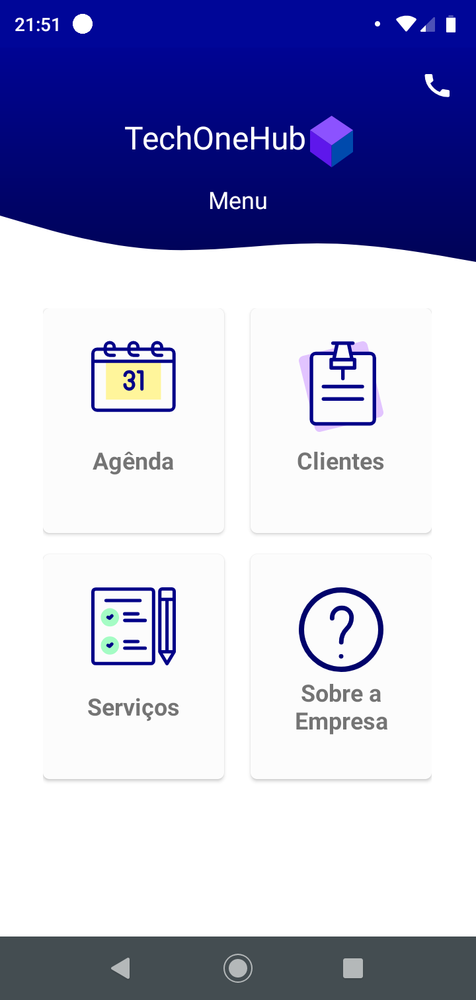
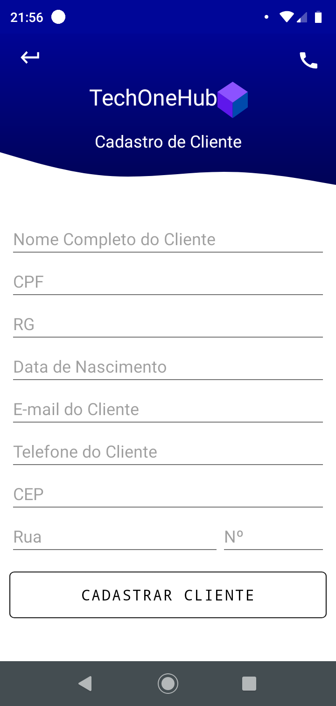
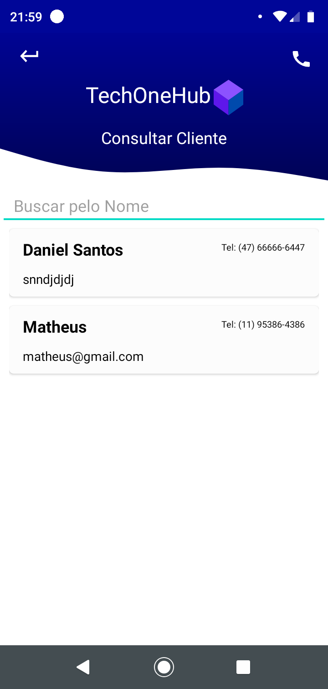
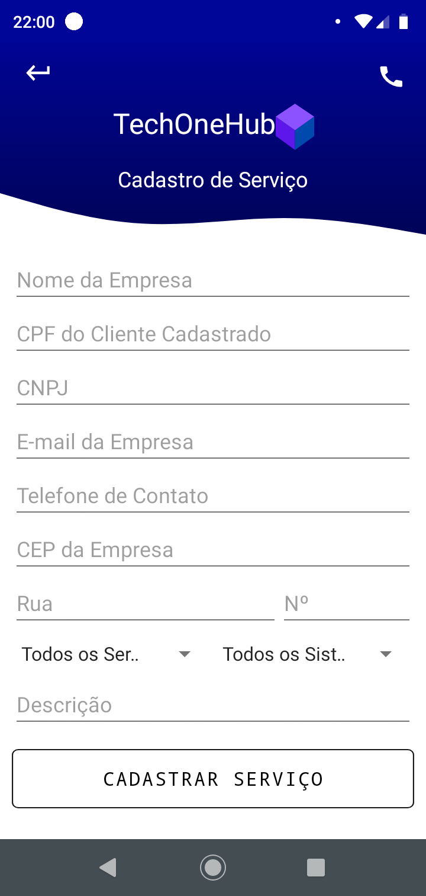
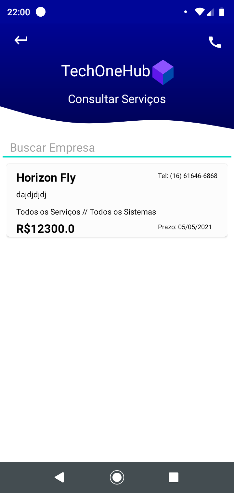
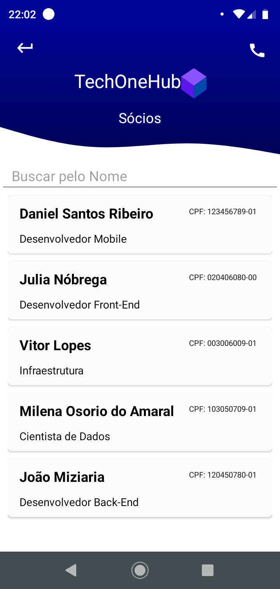

# Projeto final do 2º Semestre da ETEC

Foi realizado um aplicativo de uma empresa fictícia nesse aplicativo é possível Cadastrar, Consultar, Alterar e Deletar um Cliente e Serviço podendo ver as Agendas dos Sócios.

- Foi Utilizado SQLite para realizar o CRUD. Usando o RecyclerView para mostrar os Clientes e os Serviços que já realizaram o cadastro.

### Tecnologias utilizadas:

- [x]  Java
- [x]  SQLite

#### Login:label:

- Username da tela de Login é Tech
- Senha é 123456

#### Menu

#### Cliente

#### Servições

#### Socios

